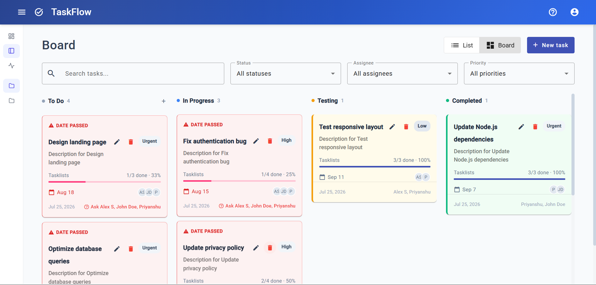
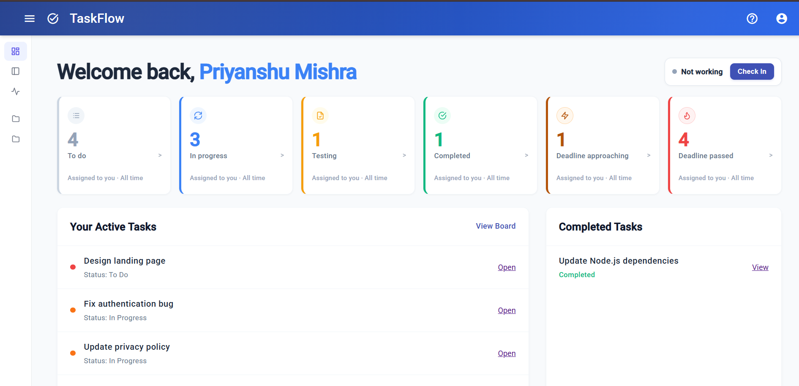
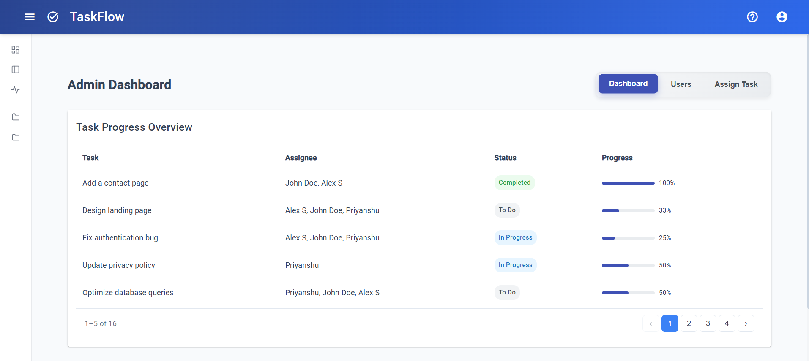
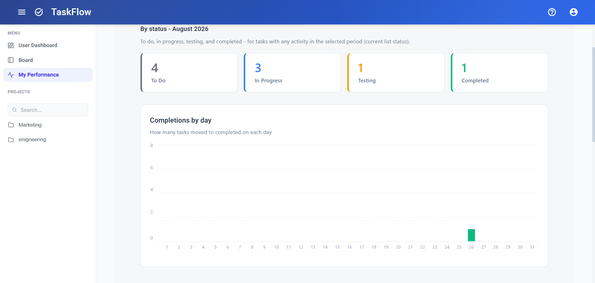
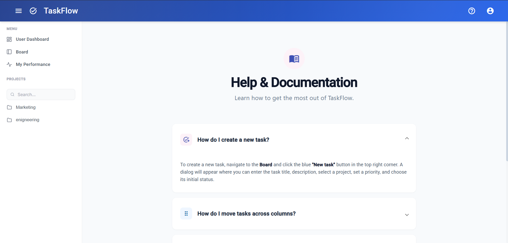

# TaskFlow - Full-Stack Task Management Application

TaskFlow is a modern, responsive, full-stack Task Management application designed for teams to organize projects, assign tasks, and track progress efficiently. It features a reactive Kanban board, robust role-based access control (RBAC), and real-time dashboard analytics.

---

## 📸 Screenshots

<details open>
  <summary><b>Click to collapse Screenshots</b></summary>
  
  ### 1. Kanban Board
  

  ### 2. User Dashboard
  

  ### 3. Admin Dashboard
  

  ### 4. Performance Analytics
  

  ### 5. Help Documentation
  
</details>

---


## 🏗️ System Architecture

The application is built using the **MEAN stack** (MongoDB, Express, Angular, Node.js), fully typed with **TypeScript** on both the frontend and backend.

### 1. Frontend Architecture (Angular 18)
The client is a Single Page Application (SPA) utilizing Angular 18's latest features like **Standalone Components**, **Control Flow Syntax** (`@if`, `@for`), and **Signals** for optimized rendering.

* **State Management:** Reactive programming using RxJS (`BehaviorSubject`, `combineLatest`) combined with Angular Signals. The UI updates instantaneously when filters (search, status, assignee) change without mutating the original datasets.
* **Component Design:** Modular standalone components grouped by feature:
  * `UserDashboardComponent`: Personal task metrics and KPIs.
  * `AdminDashboardComponent`: User creation, project management, and global task assignment.
  * `BoardComponent`: Drag-and-drop Kanban board powered by Angular CDK.
  * `TaskListComponent`: Highly reusable component functioning as both a standard list table and a Kanban column.
  * `PerformanceComponent`: Visual charts and analytics for task completion rates.
* **Routing & Security:**
  * `AuthGuard`: Secures protected routes from unauthenticated access.
  * `AdminGuard`: Restricts `/admin` routes exclusively to users with the `Admin` role.
  * `GuestGuard`: Prevents logged-in users from accessing the login/signup pages.
  * `AuthInterceptor`: Automatically attaches JWT Bearer tokens to all outgoing HTTP requests.

### 2. Backend Architecture (Node.js + Express)
The RESTful API is built with Node.js and Express, heavily utilizing middleware for validation, security, and error handling.

* **Controllers & Routes:**
  * `auth.ts`: Handles user registration, login, JWT generation, and role assignment.
  * `projects.ts`: CRUD operations for projects, including duplicate name prevention via case-insensitive Regex.
  * `tasks.ts`: Extensive task management (CRUD, status updates, assigning users, managing subtasks, and comments).
* **Middleware Layer:**
  * `auth.ts`: Verifies JWT tokens and attaches the decoded user payload to `req.user`. Includes a `requireRole` factory for RBAC.
  * `validate.ts`: Integrates with `express-validator` to enforce strict payload schemas before hitting controllers.
  * `errorHandler.ts`: Global error catcher ensuring consistent API JSON responses and preventing stack trace leaks in production.

### 3. Database Schema (MongoDB + Mongoose)
* **User:** `name`, `email`, `password` (hashed via bcrypt), `role` (Admin | Member).
* **Project:** `name`, `description`, `owner_id`.
* **Task:** 
  * Core: `title`, `description`, `status` (To Do, In Progress, Testing, Completed), `priority` (Low, Medium, High, Urgent), `due_date`.
  * Relations: `project_id` (Ref: Project), `assignee_ids` (Ref: User), `creator_id` (Ref: User).
  * Sub-documents: `subtasks` (title, is_completed), `comments` (user_id, content, created_at).

---

## 🚀 Key Features

* **Role-Based Access Control (RBAC):** Admins manage the workspace (create users/projects, oversee all tasks), while Members manage their assigned workloads.
* **Interactive Kanban Board:** Fluid drag-and-drop task progression using `@angular/cdk/drag-drop`.
* **Advanced Filtering & Pagination:** Client-side combined filtering (Search + Priority + Assignee) and server/client pagination.
* **Real-time Progress Tracking:** Tasks automatically calculate completion percentages based on subtask statuses. Overdue tasks are dynamically flagged.
* **Mobile Responsive:** CSS Grid and Flexbox layouts adapt seamlessly to mobile, tablet, and desktop screens.

---

## 📂 Project Structure

```text
Task Manager/
├── client/                     # Angular 18 Frontend
│   ├── src/
│   │   ├── app/
│   │   │   ├── components/     # Standalone UI Components (Board, Dashboards, Auth)
│   │   │   ├── guards/         # Route Protection (Admin, Auth, Guest)
│   │   │   ├── interceptors/   # HTTP Interceptors (JWT Injection)
│   │   │   ├── models/         # TypeScript Interfaces
│   │   │   ├── services/       # API Communication & State (RxJS)
│   │   │   └── shared/         # Reusable Directives (StatusColors) & Pipes (DueSoon)
│   │   ├── environments/       # Environment configs (API URLs)
│   │   └── styles.css          # Global CSS variables and base styles
│   └── package.json
│
└── server/                     # Node.js + Express Backend
    ├── src/
    │   ├── config/             # DB Connection setup
    │   ├── controllers/        # Business logic for routes
    │   ├── middleware/         # Auth, Validation, Error Handling
    │   ├── models/             # Mongoose Schemas
    │   └── routes/             # Express Router definitions
    ├── tests/                  # Jest API & Unit Tests
    └── package.json
```

---

## 🛠️ Getting Started

### Prerequisites
- Node.js (v18+ recommended)
- MongoDB Atlas cluster OR Local MongoDB instance
- Angular CLI (`npm install -g @angular/cli`)

### Environment Setup

1. **Backend Configuration:**
   Create `server/.env`:
   ```env
   PORT=3000
   MONGO_URI=mongodb+srv://<user>:<password>@cluster.mongodb.net/task_manager
   JWT_SECRET=your_super_secret_jwt_key
   ```

2. **Frontend Configuration:**
   Create `client/src/environments/environment.ts`:
   ```typescript
   export const environment = {
     production: false,
     apiUrl: 'http://localhost:3000/api'
   };
   ```

### Running the Application

1. **Start the Backend:**
   ```bash
   cd server
   npm install
   npm run dev
   ```

2. **Start the Frontend:**
   ```bash
   cd client
   npm install
   npm start
   ```

Navigate to `http://localhost:4200` in your browser.

---

## 🧪 Testing

The backend is fully equipped with an automated test suite using **Jest** and **Supertest** running against an in-memory MongoDB database (`mongodb-memory-server`) to ensure data integrity without affecting production.

```bash
cd server
npm test
```

---

# TaskFlow (Task Manager) - Project Roadmap

## Phase 1 � Foundation

*   **Day 1:** Choose the app: "TaskFlow" (a task manager). Write a feature list, user stories, and acceptance criteria.
    *   *Deliverable:* features.md + user stories
*   **Day 2:** Sketch the screens (login, task board, task form). List entities & relationships: User, Project, Task.
    *   *Deliverable:* UI sketches + entity list
*   **Day 3:** Design JSON data shapes for User / Project / Task (with ids & refs); create sample data files.
    *   *Deliverable:* sample-data.json
*   **Day 4:** Create GitHub repo; add README (goals) + .gitignore; set up client/ and server/ folders; first commit.
    *   *Deliverable:* Git repo + README
*   **Day 5:** Node script: load the sample JSON and print tasks grouped by status and sorted by due date.
    *   *Deliverable:* seed / print script
*   **Day 6:** Scaffold the Angular app (standalone) in client/; run it; commit.
    *   *Deliverable:* running Angular app
*   **Day 7:** Build TaskList + TaskCard components rendering sample tasks with @for (track) and an empty state.
    *   *Deliverable:* task list UI
*   **Day 8:** Add a signal-based TaskService (in-memory); wire the list to it; support add, edit & delete.
    *   *Deliverable:* add / edit / delete works
*   **Day 9:** Add routing: /login, /board, /task/:id, a nav shell and a wildcard 404 route.
    *   *Deliverable:* multi-route app
*   **Day 10:** Build the Add/Edit Task reactive form (title, status, due date) with validation & error messages.
    *   *Deliverable:* task form + validation

## Phase 2 � Frontend Features + Polish

*   **Day 11:** Serve tasks from a mock REST (json-server) and load them via HttpClient GET with typed models + async pipe.
    *   *Deliverable:* tasks load over HTTP
*   **Day 12:** Add search + status filter using RxJS (debounceTime, switchMap); cancel stale requests.
    *   *Deliverable:* filter / search
*   **Day 13:** Add a "dueSoon" pipe and a status-color directive on the task cards.
    *   *Deliverable:* custom pipe + directive
*   **Day 14:** Add an auth service stub + functional route guard on /board; login stores a token.
    *   *Deliverable:* guarded board
*   **Day 15:** Apply Angular Material (toolbar, cards, form fields); polish the board layout & responsiveness.
    *   *Deliverable:* Frontend MVP (mock data)

## Phase 3 � Backend API (Express)

*   **Day 16:** Scaffold an Express server in server/; add a health route; nodemon + npm scripts + a request logger.
    *   *Deliverable:* server boots
*   **Day 17:** Build task routes on an in-memory array: GET / POST / PUT / DELETE /api/tasks with correct status codes.
    *   *Deliverable:* tasks CRUD API
*   **Day 18:** Add project routes; organise into routes / controllers; keep response shapes consistent.
    *   *Deliverable:* projects API and fixed the folder structure and architecture
*   **Day 19:** Add input validation (express-validator), central error-handling middleware, CORS and dotenv config.
    *   *Deliverable:* auth-protected API
*   **Day 20:** Add auth routes: register / login (bcrypt + JWT); an auth middleware protecting the task routes.
    *   *Deliverable:* auth-protected API  
*   **Day 21:** Set up MongoDB (Atlas) + Compass; create the DB; add the connection string to .env (gitignored).
    *   *Deliverable:* DB + connection   
*   **Day 22:** Define Mongoose models: User, Project, Task (with refs, timestamps & validation).
    *   *Deliverable:* schemas / models
*   **Day 23:** Replace the in-memory store with MongoDB across all routes; handle not-found & DB errors.
    *   *Deliverable:* persistent API   
*   **Day 24:** Write API tests (Jest + Supertest) for tasks & auth (happy + error paths); fix the bugs you find.
    *   *Deliverable:* passing tests
*   **Day 25:** Clean the repo and deploy the API to Render with the DB on Atlas; verify live endpoints.
    *   *Deliverable:* live API URL         
*   **Day 26:** Point the Angular services at the deployed API; wire real auth (JWT storage + HTTP interceptor).
    *   *Deliverable:* FE talks to live API
*   **Day 27:** Implement real task CRUD end-to-end against the live API; handle loading & error states.
    *   *Deliverable:* tasks work live
*   **Day 28:** Implement real project CRUD, basic pagination, and an Admin Dashboard with role-based access control and user creation.
    *   *Deliverable:* Projects work live & Admin Dashboard
*   **Day 29:** End-to-end test the whole flow; fix bugs; polish the UI; write README + screenshots.
    *   *Deliverable:* release-ready app
