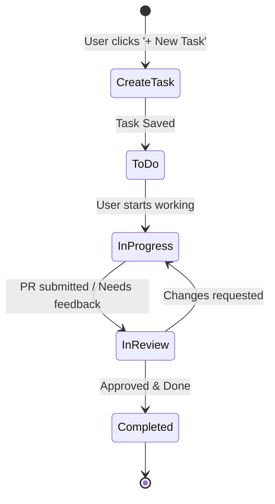
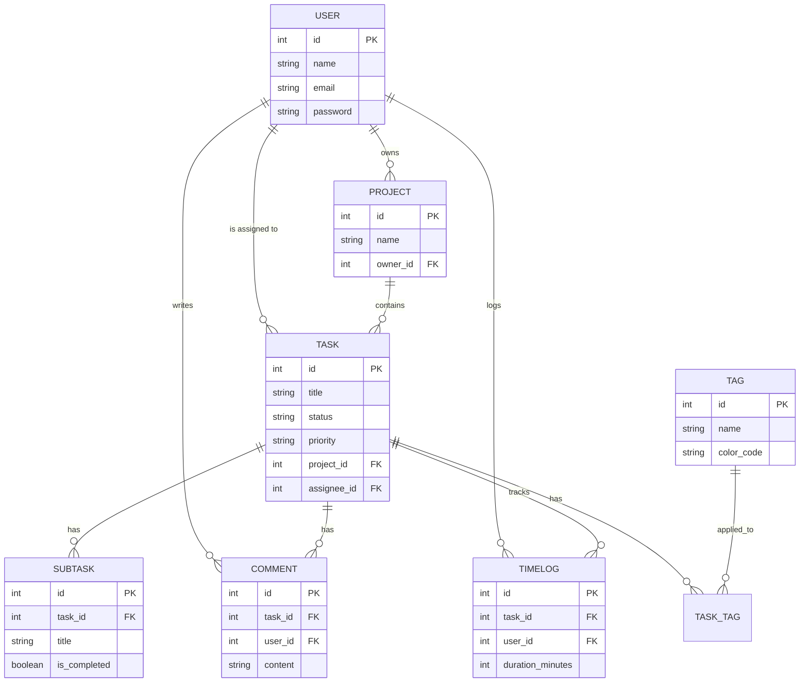

# TaskFlow: Comprehensive Design Document

## 1. Design System & Aesthetics
*   **Typography:** Primary font: *Inter* (clean, modern sans-serif). Secondary font: *Roboto Mono* for code blocks or time logs.
*   **Color Palette (Dark Mode):**
    *   **Background:** `#121212` (Deep Charcoal)
    *   **Surface/Cards:** `#1E1E1E` (Soft Dark)
    *   **Primary Accent:** `#6C63FF` (Vibrant Purple for buttons, active states)
    *   **Secondary/Success:** `#00C896` (Mint Green for 'Completed' status)
    *   **Warning/Urgent:** `#FF6B6B` (Coral Red for overdue tasks)
    *   **Text:** `#FFFFFF` (Headers), `#B3B3B3` (Body text)
*   **Color Palette (Light Mode):**
    *   **Background:** `#F8F9FA` (Off-white)
    *   **Surface/Cards:** `#FFFFFF` (Pure White)
    *   **Primary Accent:** `#6C63FF` (Vibrant Purple)
    *   **Secondary/Success:** `#20C997` (Teal/Green)
    *   **Warning/Urgent:** `#FA5252` (Bright Red)
    *   **Text:** `#212529` (Dark Gray for headers), `#495057` (Body text)
*   **UI Components:** Glassmorphism effects for modals, rounded corners (8px radius for cards, 4px for buttons), and subtle drop shadows on interactive elements for depth.

---

## 2. Enhanced UI Sketches

### Screen 1: Dashboard & Kanban Board (Desktop)
```text
+-----------------------------------------------------------------------------+
|  [Logo] TaskFlow    Search (Ctrl+K)...   [Moon/Sun Toggle] (Bell) (Avatar)  |
+-----------------------------------------------------------------------------+
|  NAVIGATION       |  Project: Alpha Re-design                  [Share] [...]|
|                   |  Filter: [All v]  Sort: [Due Date v]      [+ New Task]  |
|  (Grid) Dashboard |---------------------------------------------------------|
|  (List) My Tasks  |                                                         |
|  (Board) Projects |  TO DO (2)           IN PROGRESS (1)     COMPLETED (1)  |
|     # Alpha       |  +-----------------+ +-----------------+ +-------------+|
|     # Beta        |  | [Bug]           | | [Feature]       | | [Design]    ||
|                   |  | Fix login crash | | Add dark mode   | | Logo update ||
|  (Clock) Timer    |  | Due: Today      | | Due: Tomorrow   | | Completed!  ||
|                   |  | [JD] ( 3 cmds ) | | [AS] ( 1 cmd )  | | [JD]        ||
|  (Gear) Settings  |  +-----------------+ +-----------------+ +-------------+|
|                   |  +-----------------+                                    |
|                   |  | [Task]          |                                    |
|  [Logout]         |  | Draft emails    |                                    |
|                   |  +-----------------+                                    |
+-----------------------------------------------------------------------------+
```

### Screen 2: Task Detail View (Slide-out Panel)
```text
+-----------------------------------------------------------------------------+
|  ... Dashboard behind ...  | [Mark Complete] [Start Timer] [...]  [Close X] |
|                            |------------------------------------------------|
|                            |  [Title] Add dark mode toggle to settings      |
|                            |                                                |
|                            |  Status: [In Progress v]  Project: [Alpha v]   |
|                            |  Assignee: [@Alex S]      Due: [10/26/2026]    |
|                            |  Priority: [High v]       Tags: [#feature]     |
|                            |                                                |
|                            |  Description:                                  |
|                            |  We need a toggle in the settings menu that... |
|                            |                                                |
|                            |  Subtasks:                                     |
|                            |  [x] Create CSS variables for dark theme       |
|                            |  [ ] Add toggle UI component                   |
|                            |  [ ] Save preference to local storage          |
|                            |                                                |
|                            |  Activity & Comments:                          |
|                            |  [Alex S] - 2 hrs ago: "Working on CSS now"    |
|                            |  [ Write a comment...                     ] [> |
+-----------------------------------------------------------------------------+
```

### Screen 3: Mobile View (Responsive)
```text
+---------------------+
| (Menu) TaskFlow [☼] |
+---------------------+
| Project: Alpha      |
| [To Do v]           |
|---------------------|
| +-----------------+ |
| | Fix login crash | |
| | Due: Today      | |
| | [JD]            | |
| +-----------------+ |
| +-----------------+ |
| | Draft emails    | |
| | Due: Nov 1      | |
| | [JD]            | |
| +-----------------+ |
+---------------------+
| [Home] [Search] [Me]|
+---------------------+
```

---

## 3. User Flows

### Core Task Lifecycle Flow


---

## 4. Enhanced Entities & Relationships

Expanding the database model to support advanced features like comments, subtasks, tags, and time tracking.

### Entity List
1.  **User** (`id`, `name`, `email`, `password`, `avatar_url`, `preferences_json`)
2.  **Project** (`id`, `name`, `color_code`, `owner_id`)
3.  **Task** (`id`, `title`, `description`, `status`, `priority`, `due_date`, `project_id`, `assignee_id`)
4.  **Subtask** (`id`, `task_id`, `title`, `is_completed`)
5.  **Comment** (`id`, `task_id`, `user_id`, `content`, `created_at`)
6.  **Tag** (`id`, `name`, `color_code`)
7.  **TaskTag** (`task_id`, `tag_id`) - *Join table for Many-to-Many*
8.  **TimeLog** (`id`, `task_id`, `user_id`, `duration_minutes`, `created_at`)

### Entity-Relationship Diagram


